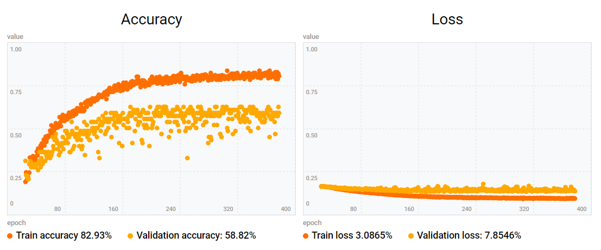

# 1-2 Finger Gesture Detection

APDS-9960 on Arduino Nano 33 BLE Sense can only detect 4 gestures (up, down, left and right,) however this tool can detect 8 gestures by using TensorFlow Lite.

##  How to run

1. Run TF4Micro Motion Kit for APDS on Arduino
    - See [TF4Micro Motion Kit for APDS](https://github.com/kuromusha/tf4micro-motion-kit-apds).

1. Go to the URL by using Chrome browser
    - [1-2 Finger Gesture Detection](https://xetter.com/1-2-finger-gesture-detection/)

1. Click 'Connect' button
    - Wait until Arduino is connected.
    - It may take a minute.

1. Click 'Model Transfer' button
    - Wait until the transfer is finished.
    - It may take a couple of minutes.

1. Swipe your fingers above Arduino
    - This tool can detect 8 gestures.
        - Right with 1 finger
        - Right with 2 fingers
        - Left with 1 finger
        - Left with 2 fingers
        - Up with 1 finger
        - Up with 2 fingers
        - Down with 1 finger
        - Down with 2 fingers

---

## Training data

This tool uses the data from APDS:

- Proximity  
Proximity is also used to start/stop captures.
- Gesture (4 ways; up, down, left and right)
- RGB Color  
RGB Color is converted into HSV Color.

Here is training data used to make this tool's model. Each gesture has 40 data.

- [1-2-finger-gesture-detection.json](web/static/1-2-finger-gesture-detection.json)

The training result is like this. (This is not so good...)

---

## Web codes

The original web codes are based on https://github.com/googlecreativelab/tf4micro-motion-kit .

The code diffs are [here](https://github.com/kuromusha/1-2-finger-gesture-detection/compare/847d44f60f852e483cc2abbf321d673af75a105c..master).
